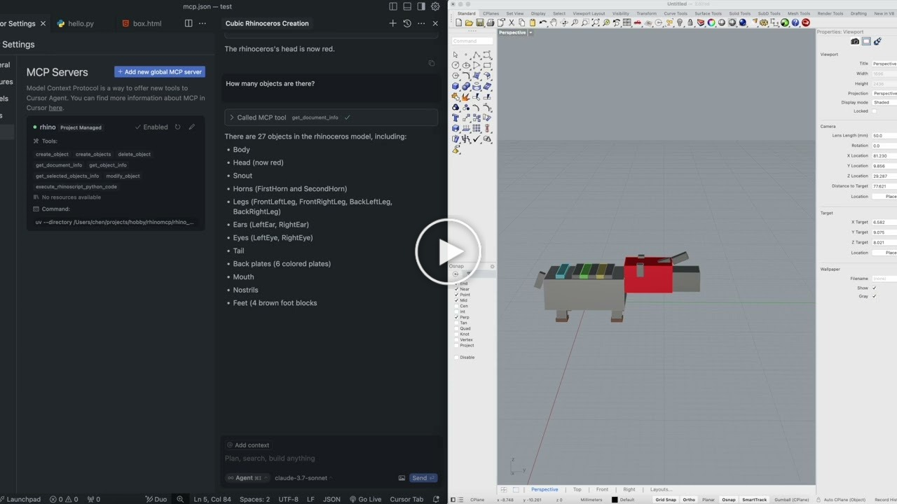
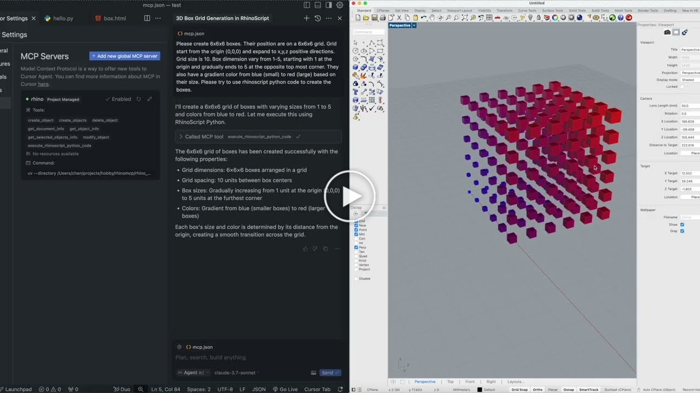
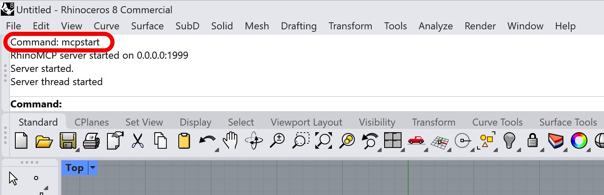
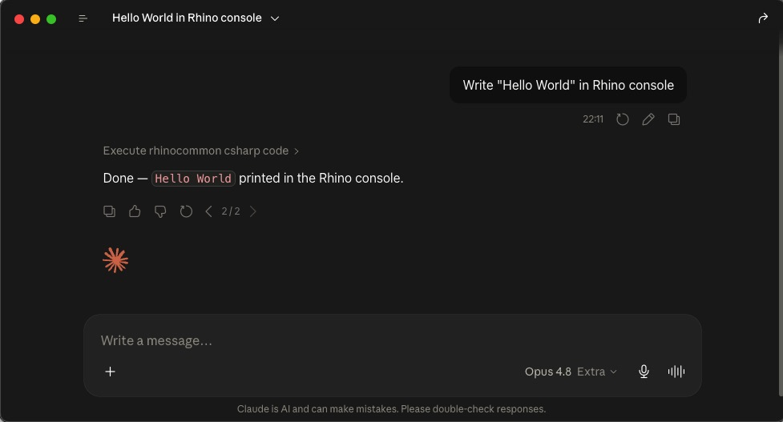

<div align="center">


# RhinoMCP

**Control Rhino 3D and Grasshopper with AI, in plain language.**

RhinoMCP connects Rhino to AI agents through the [Model Context Protocol](https://modelcontextprotocol.io),
so assistants like Claude and Cursor can model geometry, read your document, and build
Grasshopper definitions for you, just by chatting.

[](https://pypi.org/project/rhinomcp/)
[](https://www.rhino3d.com/)
[](https://www.python.org/)
[](https://modelcontextprotocol.io/)
[](LICENSE)

[Quick start](#quick-start) · [What it can do](#what-it-can-do) · [Usage](#usage) · [Examples](#example-prompts) · [Tool reference](#tool-reference)

**English** · [简体中文](README.zh-CN.md)

</div>

---

## Highlights

- Describe what you want and the assistant builds it in Rhino.
- It reads your document and can capture the viewport, so it works from what is actually on screen.
- It scripts Grasshopper for you: finding components, wiring them, setting sliders, and solving.
- A single plugin and a single config entry cover both Rhino and Grasshopper.
- When you need more control, it can run native Rhino commands, RhinoScript-Python, or RhinoCommon C#.

> [!NOTE]
> RhinoMCP targets **Rhino 8** on Windows and macOS.

## Demos

<table>
<tr>
<td width="50%" align="center">

[](https://youtu.be/pi6dbqUuhI4)

**Two-way interaction:** the AI both creates and reads geometry.

</td>
<td width="50%" align="center">

[](https://youtu.be/NFOF_Pjp3qY)

**Custom scripts:** the AI writes and runs scripts inside Rhino.

</td>
</tr>
</table>

Prefer a walkthrough? Nate made a showcase and install [tutorial on YouTube](https://www.youtube.com/watch?v=z2IBP81ABRM).

## What it can do

###  Rhino

| Area                | What the AI can do                                                                                                                     |
| ------------------- | -------------------------------------------------------------------------------------------------------------------------------------- |
| Create geometry     | Points, lines, polylines, circles, arcs, ellipses, curves, boxes, spheres, cones, cylinders, and surfaces, one at a time or in batches |
| Transform & edit    | Move, rotate, scale, recolor, rename, and delete objects                                                                               |
| Advanced modeling   | Loft, extrude, sweep, offset, pipe; boolean union, difference, and intersection                                                        |
| Curve operations    | Project, intersect, and split curves                                                                                                   |
| Layers & attributes | Create, delete, and switch layers; read and write object attributes                                                                    |
| Inspect & select    | Document summaries, object info, and filtered selection (by name, color, or category, with AND / OR logic)                             |
| See the model       | Capture the viewport so the AI gets visual feedback                                                                                    |
| Analyze             | Measure length, area, volume, bounding boxes, and more                                                                                 |
| Go deeper           | Run any Rhino command, execute RhinoScript-Python, or run RhinoCommon C#, with built-in RhinoScript docs lookup                        |

###  Grasshopper

| Area              | What the AI can do                                                                                    |
| ----------------- | ----------------------------------------------------------------------------------------------------- |
| Find components   | Search the installed component library and inspect a component's inputs and outputs before placing it |
| Build canvases    | Add, position, lay out, update, and delete components                                                 |
| Wire it up        | Connect and disconnect parameters between components                                                  |
| Set & read values | Drive sliders, toggles, panels, and value lists; read structured data back out of outputs             |
| Solve             | Run the solution and surface runtime warnings and errors                                              |
| Build in one shot | Construct and wire a whole graph, or mutate an existing one, in a single batched operation            |

## Quick start

Three steps: install the Rhino plugin, connect your AI client, then start the bridge in Rhino.

### 1. Install the Rhino plugin

In Rhino, open **Tools → Package Manager**, search for **`rhinomcp`**, and click **Install**. Restart Rhino.

### 2. Connect your AI client

#### Option A: ask your AI assistant to install it (recommended)

If you use an agentic assistant (Codex, Claude Code, Cursor, Cline, and the like), paste this prompt:

> Please install https://github.com/jingcheng-chen/rhinomcp as a local MCP server named `rhino`.

#### Option B: Install the mcp server or manually edit the config yourself

**Codex**, in one command:

```bash
codex mcp add rhino --env RHINO_MCP_HOST=127.0.0.1 -- uvx rhinomcp
```

**Claude Code**, in one command:

```bash
claude mcp add rhino -- uvx rhinomcp
```

**ChatGPT:** use Codex for the local setup above. ChatGPT apps/MCP connectors currently connect
to remote MCP servers, not local stdio commands like `uvx rhinomcp`. If you want to build a
ChatGPT app around RhinoMCP, use ChatGPT developer mode with a remote or tunneled MCP endpoint.

You can also manually edit the config yourself:

```json
{
  "mcpServers": {
    "rhino": {
      "command": "uvx",
      "args": ["rhinomcp"],
      "env": {
        "RHINO_MCP_HOST": "127.0.0.1"
      }
    }
  }
}
```

> [!IMPORTANT]
> The launcher `uvx` comes from [**uv**](https://docs.astral.sh/uv/). If you don't have it yet:
> macOS `brew install uv` · Windows `powershell -c "irm https://astral.sh/uv/install.ps1 | iex"`
>
> Run **only one** RhinoMCP server at a time (Codex, Claude, Cursor, etc. — not several at once).

<details>
<summary>Auto-restart the server with your AI client (optional)</summary>

To clean up a stale `rhinomcp` process each time your client launches:

**macOS / Linux**

```json
{
  "mcpServers": {
    "rhino": {
      "command": "sh",
      "args": ["-c", "killall rhinomcp 2>/dev/null; uvx rhinomcp"]
    }
  }
}
```

**Windows**

```json
{
  "mcpServers": {
    "rhino": {
      "command": "cmd",
      "args": ["/c", "taskkill /F /IM rhinomcp.exe 2>nul & uvx rhinomcp"]
    }
  }
}
```

</details>

### 3. Start the Rhino bridge

With Rhino open, type **`mcpstart`** in the command line. This starts the TCP bridge the server
connects to (`mcpstop` ends it). Run it once per Rhino session.

## Usage

With the bridge running and your client connected, you'll see the RhinoMCP tools. From there, just
chat: ask the assistant to model something, inspect your scene, or build a Grasshopper graph.

</td>
</td>

For Grasshopper, you only need Rhino open with `mcpstart` running. The assistant can open or create
the Grasshopper document itself, then build the definition. For example: _"create a point attractor
pattern with cylinders that have different heights."_

## Example prompts

> Create 6×6×6 boxes on a 10-unit grid from the origin, sizes ramping from 1 to 5,
> with a blue-to-red gradient color based on size. Use RhinoScript Python.

> Make a Rhinoceros animal out of cubic blocks in cartoon colors. Then change its head to red,
> and rotate the selected object 90° around the Z axis.

> Create a point attractor pattern in Grasshopper: a grid of cylinders whose heights change with
> their distance from an attractor point, with a slider to move the point.

## Tool reference

<details>
<summary><b>Rhino tools</b></summary>

| Tool                                                                                                          | Purpose                                                |
| ------------------------------------------------------------------------------------------------------------- | ------------------------------------------------------ |
| `create_object` / `create_objects`                                                                            | Create one or many objects                             |
| `modify_object` / `modify_objects`                                                                            | Transform or edit one or many objects                  |
| `delete_object`                                                                                               | Delete an object                                       |
| `boolean_union` / `boolean_difference` / `boolean_intersection`                                               | Boolean operations                                     |
| `loft` / `extrude_curve` / `sweep1` / `offset_curve` / `pipe`                                                 | Advanced surface and solid modeling                    |
| `project_curve` / `intersect_curves` / `split_curve`                                                          | Curve operations                                       |
| `analyze_objects`                                                                                             | Measure length, area, volume, bounding boxes, and more |
| `select_objects`                                                                                              | Select by filters (name, color, category; AND / OR)    |
| `get_objects` / `get_object_info` / `get_selected_objects_info`                                               | Query objects                                          |
| `get_object_attributes` / `update_object_attributes`                                                          | Read and write object attributes                       |
| `create_layer` / `delete_layer` / `get_or_set_current_layer`                                                  | Layer management                                       |
| `get_document_summary`                                                                                        | Overview of the current document                       |
| `capture_viewport`                                                                                            | Screenshot the viewport for visual feedback            |
| `run_command`                                                                                                 | Run any native Rhino command                           |
| `execute_rhinoscript_python_code`                                                                             | Execute RhinoScript-Python                             |
| `execute_rhinocommon_csharp_code`                                                                             | Execute RhinoCommon C#                                 |
| `search_rhinoscript_functions` / `get_rhinoscript_docs` / `list_rhinoscript_modules` / `get_module_functions` | RhinoScript API docs lookup                            |
| `get_commands`                                                                                                | List available commands                                |
| `undo` / `redo`                                                                                               | Undo and redo                                          |

</details>

<details>
<summary><b>Grasshopper tools</b></summary>

| Tool                                                                  | Purpose                                           |
| --------------------------------------------------------------------- | ------------------------------------------------- |
| `gh_create_document` / `gh_get_document_info` / `gh_get_canvas_state` | Document and canvas inspection                    |
| `gh_search_components` / `gh_batch_search_components`                 | Search the component library                      |
| `gh_list_component_categories` / `gh_get_available_components`        | Browse installed components                       |
| `gh_get_component_type_info` / `gh_get_component_info`                | Inspect a component type or instance              |
| `gh_list_components`                                                  | List components on the canvas                     |
| `gh_add_component` / `gh_update_component` / `gh_delete_component`    | Add, update, or delete components                 |
| `gh_layout_components`                                                | Auto-lay-out the canvas                           |
| `gh_clear_canvas`                                                     | Clear the canvas                                  |
| `gh_connect_components` / `gh_disconnect_components`                  | Wire or unwire parameters                         |
| `gh_set_parameter_value` / `gh_get_parameter_value`                   | Drive inputs, read outputs                        |
| `gh_run_solution` / `gh_expire_solution`                              | Solve or expire the solution                      |
| `gh_build_graph` / `gh_mutate_graph`                                  | Build or mutate a whole graph in one batched call |
| `gh_get_graph` / `gh_clear_graph`                                     | Inspect or clear objects by graph id              |

</details>

## How it works

```
AI client ──MCP (stdio)──► rhinomcp (Python) ──TCP 127.0.0.1:1999──► Rhino plugin ──► Rhino + Grasshopper
```

1. `server/`: a Python [FastMCP](https://modelcontextprotocol.io) server that exposes each tool and forwards it to Rhino.
2. `plugin/`: a RhinoCommon C# plugin that runs a TCP listener inside Rhino and executes commands on the main thread. Start and stop it with the `mcpstart` / `mcpstop` Rhino commands.
3. `contracts/`: JSON Schema definitions that keep the wire protocol between the two tiers in sync.

`IMPLEMENTATION.md` has a deeper tour of the code.

## Security

The Python server and the Rhino plugin talk over an unauthenticated TCP loopback link
(`127.0.0.1:1999`). Tools such as `run_command`, `execute_rhinoscript_python_code`, and
`execute_rhinocommon_csharp_code` give the model an open execution surface inside Rhino. This is
fine for local agent use. Do not expose it beyond the loopback interface without adding
authentication.

<details>
<summary>Operator switches (environment variables)</summary>

| Variable                       | Default     | Effect                                                                        |
| ------------------------------ | ----------- | ----------------------------------------------------------------------------- |
| `RHINO_MCP_HOST`               | `127.0.0.1` | Connect target. Refuses non-loopback hosts unless `RHINO_MCP_ALLOW_REMOTE=1`. |
| `RHINO_MCP_PORT`               | `1999`      | TCP port.                                                                     |
| `RHINO_MCP_ENABLE_RUN_COMMAND` | `1`         | Set `0` to disable the `run_command` tool.                                    |
| `RHINO_MCP_ENABLE_RHINOSCRIPT` | `1`         | Set `0` to disable RhinoScript-Python execution.                              |
| `RHINO_MCP_ENABLE_CSHARP`      | `1`         | Set `0` to disable RhinoCommon C# execution.                                  |
| `RHINO_MCP_VALIDATE`           | `warn`      | Pre-flight schema validation: `off` / `warn` / `strict`.                      |
| `RHINO_MCP_TIMEOUT`            | `15.0`      | Socket timeout in seconds.                                                    |
| `RHINO_MCP_DEBUG`              | `0`         | Verbose logging.                                                              |

</details>

## For developers

<details>
<summary>Build, test, and publish</summary>

**Python server** (run from `server/`)

```bash
uv venv && uv pip install -e ".[dev]"   # set up
uv run pytest                            # run tests (no Rhino needed; uses a mock server)
uv run ruff check src/rhinomcp           # lint
uv run python ../contracts/test_schemas.py   # validate JSON schemas
uv build && uv publish                   # publish to PyPI
```

**C# plugin**

```bash
dotnet restore plugin/rhinomcp.sln
dotnet build plugin/rhinomcp.sln --configuration Release
```

To publish the plugin: build in Release, copy `manifest.yml` into `bin/Release`, then run
`yak build` and `yak push rhinomcp_xxxx.yak`.

</details>

## Contributing

Contributions are welcome. Feel free to open an issue or submit a pull request.

## Disclaimer

This is a third-party integration and is not made by McNeel. Built by
[Jingcheng Chen](https://github.com/jingcheng-chen).

## Star history

[](https://www.star-history.com/#jingcheng-chen/rhinomcp&Date)
