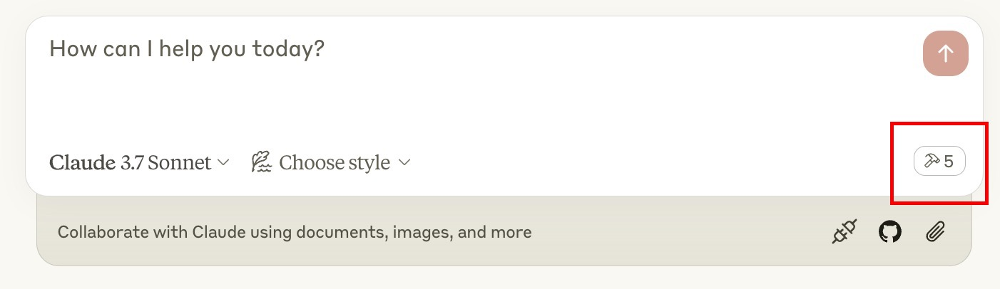
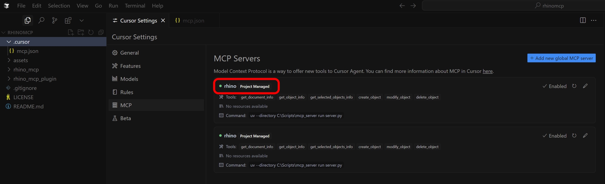
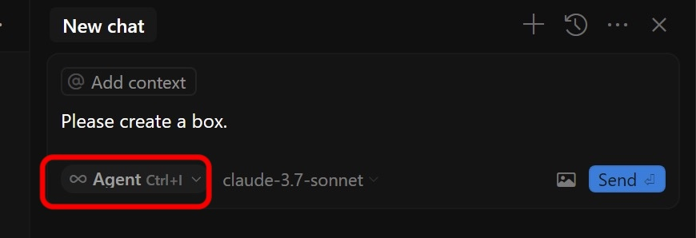

<div align="center">


# RhinoMCP

**用自然语言，通过 AI 操控 Rhino 3D 和 Grasshopper。**

RhinoMCP 通过[模型上下文协议（Model Context Protocol）](https://modelcontextprotocol.io)将 Rhino 接入
AI 智能体，让 Claude、Cursor 等助手只需对话，就能为你建模、读取文档、并搭建 Grasshopper 定义。

[](https://pypi.org/project/rhinomcp/)
[](https://www.rhino3d.com/)
[](https://www.python.org/)
[](https://modelcontextprotocol.io/)
[](LICENSE)

[快速开始](#快速开始) · [功能一览](#功能一览) · [使用](#使用) · [示例提示词](#示例提示词) · [工具参考](#工具参考)

[English](README.md) · **简体中文**

</div>

---

## 亮点

- 描述你想要的东西，助手就在 Rhino 中把它建出来。
- 它会读取你的文档，还能截取视口画面，因此能基于屏幕上的实际内容工作。
- 它替你操作 Grasshopper：查找组件、连线、设置滑块并求解。
- 一个插件、一条配置项，同时覆盖 Rhino 和 Grasshopper。
- 需要更精细的控制时，它可以运行原生 Rhino 命令、执行 RhinoScript-Python 或 RhinoCommon C#。

> [!NOTE]
> RhinoMCP 面向 Windows 与 macOS 上的 **Rhino 8**。

## 演示

<table>
<tr>
<td width="50%" align="center">

[](https://youtu.be/pi6dbqUuhI4)

**双向交互：** AI 既能创建几何体，也能读取几何体。

</td>
<td width="50%" align="center">

[](https://youtu.be/NFOF_Pjp3qY)

**自定义脚本：** AI 在 Rhino 内编写并运行脚本。

</td>
</tr>
</table>

想看完整演示？Nate 制作了一个展示与安装[教程（YouTube）](https://www.youtube.com/watch?v=z2IBP81ABRM)。

## 功能一览

### Rhino

| 类别 | AI 能做什么 |
| --- | --- |
| 创建几何体 | 点、线、多段线、圆、圆弧、椭圆、曲线、立方体、球体、圆锥、圆柱、曲面，可单个创建也可批量创建 |
| 变换与编辑 | 移动、旋转、缩放、改色、重命名、删除对象 |
| 高级建模 | 放样、挤出、扫掠、偏移、管道；布尔并集、差集与交集 |
| 曲线操作 | 投影、求交、分割曲线 |
| 图层与属性 | 创建、删除、切换图层；读写对象属性 |
| 检视与选择 | 文档摘要、对象信息，以及按条件（名称、颜色、类别，支持 AND / OR 逻辑）筛选选择 |
| 看到模型 | 截取视口画面，为 AI 提供视觉反馈 |
| 分析 | 测量长度、面积、体积、包围盒等 |
| 更进一步 | 运行任意 Rhino 命令、执行 RhinoScript-Python 或 RhinoCommon C#，并内置 RhinoScript 文档查询 |

### Grasshopper

| 类别 | AI 能做什么 |
| --- | --- |
| 查找组件 | 搜索已安装的组件库，并在放置前检视组件的输入与输出 |
| 搭建画布 | 添加、定位、布局、更新、删除组件 |
| 连线 | 在组件之间连接与断开参数 |
| 设置与读取数值 | 驱动滑块、开关、面板和值列表；从输出端读回结构化数据 |
| 求解 | 运行解算方案并报告运行期的警告与错误 |
| 一次性搭建 | 在一次批量操作中构建并连好整张图，或修改已有的图 |

## 快速开始

三步：安装 Rhino 插件、连接 AI 客户端，然后在 Rhino 中启动桥接。

### 1. 安装 Rhino 插件

在 Rhino 中打开 **Tools → Package Manager**，搜索 **`rhinomcp`**，点击 **Install**，然后重启 Rhino。

### 2. 连接 AI 客户端

#### 方式 A：让 AI 帮你配置（最简单）

RhinoMCP 已发布到 PyPI，因此无需克隆或编译。如果你使用智能体型助手（Claude Code、Cursor、Cline 等），
直接让它帮你安装服务器即可。

**Claude Code**，一条命令搞定：

```bash
claude mcp add rhino -- uvx rhinomcp
```

**任意 AI 编程助手**，粘贴这段提示词：

> 在我的 MCP 配置里添加一个名为 `rhino` 的 MCP 服务器。它是 PyPI 包 `rhinomcp`，
> 用命令 `uvx` 加参数 `rhinomcp` 启动。使用仅本地（`127.0.0.1`）的配置。

#### 方式 B：自己编辑配置

将以下内容加入客户端的 MCP 配置：

```json
{
  "mcpServers": {
    "rhino": {
      "command": "uvx",
      "args": ["rhinomcp"]
    }
  }
}
```

- **Claude Desktop：** Settings → Developer → Edit Config → `claude_desktop_config.json`
- **Cursor：** Settings → MCP → Add new server（或在项目中创建 `.cursor/mcp.json`）

> [!IMPORTANT]
> 启动器 `uvx` 来自 [**uv**](https://docs.astral.sh/uv/)。如果你还没安装：
> macOS `brew install uv` · Windows `powershell -c "irm https://astral.sh/uv/install.ps1 | iex"`
>
> 同一时间**只运行一个** RhinoMCP 服务器（Claude 或 Cursor，二选一）。

<details>
<summary>让服务器随 AI 客户端自动重启（可选）</summary>

每次客户端启动时清理残留的 `rhinomcp` 进程：

**macOS / Linux**

```json
{
  "mcpServers": {
    "rhino": {
      "command": "sh",
      "args": ["-c", "killall rhinomcp 2>/dev/null; uvx rhinomcp"]
    }
  }
}
```

**Windows**

```json
{
  "mcpServers": {
    "rhino": {
      "command": "cmd",
      "args": ["/c", "taskkill /F /IM rhinomcp.exe 2>nul & uvx rhinomcp"]
    }
  }
}
```

</details>

### 3. 启动 Rhino 桥接

打开 Rhino 后，在命令行输入 **`mcpstart`**。这会启动服务器要连接的 TCP 桥接（用 `mcpstop` 结束）。
每个 Rhino 会话运行一次即可。

## 使用

桥接已启动、客户端已连接后，你就能看到 RhinoMCP 的工具。接下来直接对话即可：让助手建个模型、
检视当前场景，或搭建一张 Grasshopper 图。

<table>
<tr>
<td></td>
<td></td>
</tr>
</table>

使用 Grasshopper 时，你只需打开 Rhino 并运行 `mcpstart`。助手可以自行打开或新建 Grasshopper 文档，
再搭建定义。例如：*“创建一个点吸引子图案，用一组高度各不相同的圆柱体。”*

<details>
<summary>Cursor 连接检查</summary>

在 Cursor 中，连接成功的服务器会在 **Settings → MCP** 中显示绿色指示。若不是绿色，刷新该服务器。
用 `Ctrl+I` 打开对话框，并确认已选择 **Agent** 模式。




</details>

## 示例提示词

> 创建 6×6×6 的立方体，排在以原点为起点、边长 10 的网格上，尺寸从 1 渐变到 5，
> 并按尺寸做蓝到红的渐变上色。请用 RhinoScript Python 实现。

> 用立方块拼出一只犀牛，配上卡通配色。然后把它的头改成红色，
> 并把所选对象绕 Z 轴旋转 90°。

> 在 Grasshopper 中创建一个点吸引子图案：一组圆柱体，高度随其到吸引点的距离变化，
> 并用一个滑块来移动该吸引点。

## 工具参考

<details>
<summary><b>Rhino 工具</b></summary>

| 工具 | 用途 |
| --- | --- |
| `create_object` / `create_objects` | 创建一个或多个对象 |
| `modify_object` / `modify_objects` | 变换或编辑一个或多个对象 |
| `delete_object` | 删除对象 |
| `boolean_union` / `boolean_difference` / `boolean_intersection` | 布尔运算 |
| `loft` / `extrude_curve` / `sweep1` / `offset_curve` / `pipe` | 高级曲面与实体建模 |
| `project_curve` / `intersect_curves` / `split_curve` | 曲线操作 |
| `analyze_objects` | 测量长度、面积、体积、包围盒等 |
| `select_objects` | 按条件选择（名称、颜色、类别；AND / OR） |
| `get_objects` / `get_object_info` / `get_selected_objects_info` | 查询对象 |
| `get_object_attributes` / `update_object_attributes` | 读写对象属性 |
| `create_layer` / `delete_layer` / `get_or_set_current_layer` | 图层管理 |
| `get_document_summary` | 当前文档概览 |
| `capture_viewport` | 截取视口画面以提供视觉反馈 |
| `run_command` | 运行任意原生 Rhino 命令 |
| `execute_rhinoscript_python_code` | 执行 RhinoScript-Python |
| `execute_rhinocommon_csharp_code` | 执行 RhinoCommon C# |
| `search_rhinoscript_functions` / `get_rhinoscript_docs` / `list_rhinoscript_modules` / `get_module_functions` | RhinoScript API 文档查询 |
| `get_commands` | 列出可用命令 |
| `undo` / `redo` | 撤销与重做 |

</details>

<details>
<summary><b>Grasshopper 工具</b></summary>

| 工具 | 用途 |
| --- | --- |
| `gh_create_document` / `gh_get_document_info` / `gh_get_canvas_state` | 文档与画布检视 |
| `gh_search_components` / `gh_batch_search_components` | 搜索组件库 |
| `gh_list_component_categories` / `gh_get_available_components` | 浏览已安装组件 |
| `gh_get_component_type_info` / `gh_get_component_info` | 检视组件类型或实例 |
| `gh_list_components` | 列出画布上的组件 |
| `gh_add_component` / `gh_update_component` / `gh_delete_component` | 添加、更新或删除组件 |
| `gh_layout_components` | 自动布局画布 |
| `gh_clear_canvas` | 清空画布 |
| `gh_connect_components` / `gh_disconnect_components` | 连接或断开参数 |
| `gh_set_parameter_value` / `gh_get_parameter_value` | 驱动输入、读取输出 |
| `gh_run_solution` / `gh_expire_solution` | 触发或过期解算 |
| `gh_build_graph` / `gh_mutate_graph` | 一次批量调用构建或修改整张图 |
| `gh_get_graph` / `gh_clear_graph` | 按图 id 检视或清除对象 |

</details>

## 工作原理

```
AI client ──MCP (stdio)──► rhinomcp (Python) ──TCP 127.0.0.1:1999──► Rhino plugin ──► Rhino + Grasshopper
```

1. `server/`：一个 Python [FastMCP](https://modelcontextprotocol.io) 服务器，对外暴露每个工具并转发给 Rhino。
2. `plugin/`：一个 RhinoCommon C# 插件，在 Rhino 内运行 TCP 监听器，并在主线程上执行命令。用 Rhino 命令 `mcpstart` / `mcpstop` 启停。
3. `contracts/`：JSON Schema 定义，确保两端之间的通信协议保持一致。

`IMPLEMENTATION.md` 提供更深入的代码导览。

## 安全性

Python 服务器与 Rhino 插件之间通过一条**无身份验证的 TCP 回环**链路（`127.0.0.1:1999`）通信。
`run_command`、`execute_rhinoscript_python_code`、`execute_rhinocommon_csharp_code` 等工具会让模型在
Rhino 内拥有完全开放的代码执行能力。用于本地智能体场景没有问题，但**不要在未加入身份验证的情况下，
将其暴露到回环接口之外**。

<details>
<summary>运维开关（环境变量）</summary>

| 变量 | 默认值 | 作用 |
| --- | --- | --- |
| `RHINO_MCP_HOST` | `127.0.0.1` | 连接目标。除非同时设置 `RHINO_MCP_ALLOW_REMOTE=1`，否则拒绝非回环主机。 |
| `RHINO_MCP_PORT` | `1999` | TCP 端口。 |
| `RHINO_MCP_ENABLE_RUN_COMMAND` | `1` | 设为 `0` 可禁用 `run_command` 工具。 |
| `RHINO_MCP_ENABLE_RHINOSCRIPT` | `1` | 设为 `0` 可禁用 RhinoScript-Python 执行。 |
| `RHINO_MCP_ENABLE_CSHARP` | `1` | 设为 `0` 可禁用 RhinoCommon C# 执行。 |
| `RHINO_MCP_VALIDATE` | `warn` | 发送前的 schema 校验：`off` / `warn` / `strict`。 |
| `RHINO_MCP_TIMEOUT` | `15.0` | 套接字超时（秒）。 |
| `RHINO_MCP_DEBUG` | `0` | 详细日志。 |

</details>

## 面向开发者

<details>
<summary>构建、测试与发布</summary>

**Python 服务器**（在 `server/` 目录下运行）

```bash
uv venv && uv pip install -e ".[dev]"   # 初始化环境
uv run pytest                            # 运行测试（无需 Rhino；使用 mock 服务器）
uv run ruff check src/rhinomcp           # 代码检查
uv run python ../contracts/test_schemas.py   # 校验 JSON schema
uv build && uv publish                   # 发布到 PyPI
```

**C# 插件**

```bash
dotnet restore plugin/rhinomcp.sln
dotnet build plugin/rhinomcp.sln --configuration Release
```

发布插件：以 Release 模式编译，将 `manifest.yml` 复制到 `bin/Release`，然后运行
`yak build` 和 `yak push rhinomcp_xxxx.yak`。

</details>

## 贡献

欢迎贡献。请放心提交 issue 或 pull request。

## 免责声明

这是一个第三方集成，并非由 McNeel 制作。由 [Jingcheng Chen](https://github.com/jingcheng-chen) 开发。

## Star 历史

[](https://www.star-history.com/#jingcheng-chen/rhinomcp&Date)
