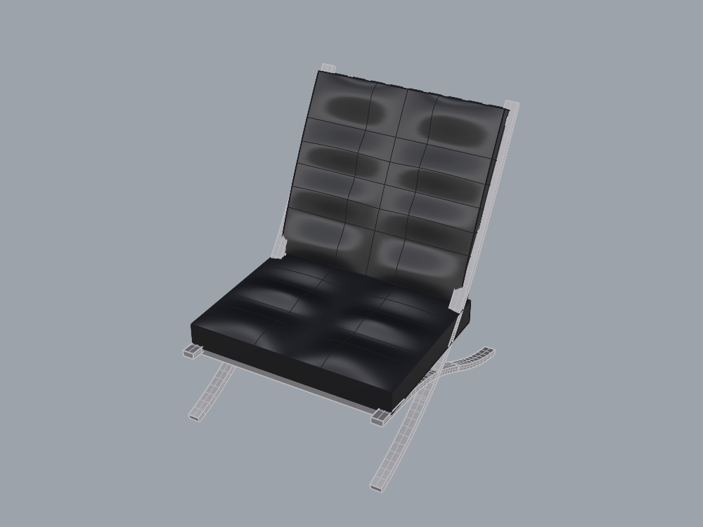

# Chair integration diagnostic

This is a new attempt using the same four public screenshots as the original
Barcelona-chair baseline. The target mesh and reserved rear-oblique image are not
available to the modeler or planner. The task retains the width-normalization and
coordinate conventions, and remains a qualitative diagnostic with visual acceptance
**unscored**. It is one benchmark in the general improvement suite.

## What changed for this attempt

The supervisor added reusable workflow guidance from the completed focused tests:
continuous cushion skins with sides and undersides joined into bodies, capped
rectangular frame sweeps, and an explicit functional layer tree. The agent infers
chair dimensions, tilt, cell arrangement and curves from the public screenshots;
the prompt does not provide a chair construction script or reference mesh.

`integration_mcp.py` extends the screenshot gateway with object-attribute inspection
and a UUID-only native Join recipe. Read-only planning rejects Join in code as well
as in client settings. `integration_runner.py` keeps the original diagnostic runner
unchanged and records all new prompts, source hashes, tools and measurements.
The same existing production plugin remains installed; no new repair is claimed.

This is a combined integration test of previously changed tools plus new guidance
and gateway access. It does not isolate the causal benefit of any one change, and
agent model versions are not explicitly pinned. The first chair attempt's metrics
and saved geometry remain historical records.

## What the audit establishes

The original nine structural observations remain separate from six new integration
observations: the Chair layer tree, visibility/lock state, nonplanar solid seat/back
bodies, closed frame pieces and functional assignments. File3dm reads are repeated
with identical results and unchanged file hashes. Object names indicate intended
roles but do not establish semantic correctness; a nonplanar solid does not prove
continuous tufting, correct proportions or visual likeness. These new observations
are diagnostic, not a calibrated chair-acceptance gate.

The task requires exactly eight Chair paths, with frame left/right branches,
upholstery seat/back branches and straps. The audit checks those paths and all
object assignments; unrelated empty layers are outside its hierarchy predicate.
A human/supervisory review must also inspect unexpected newly created empty layers.

## Comparable model views

`compare_models.py` reads display copies of both saved files, aligns their XY
bounding-box centers and ground level, gives them the same neutral gray color,
and uses a common padded union box and projection for each view. It does not scale
or rotate either model. The same camera location, direction, up vector, target and
frustum are recorded for the two captures. Source files remain unchanged.
These are matched **model-to-model** views, not matched Sketchfab cameras.
The comparison is qualitative and not a silhouette score.

The comparison helper preserves the live document geometry/attributes and restores
view projections/display modes. `finish_integration.py` then cleans only the owned
dedicated document, restores the starting tolerance and display modes, and compares
the original document fingerprint. Partial or failed modeling output is saved for
diagnosis; a failed review does not silently become an accepted run.

## Saved result and audit recovery

Run: `runs/integration-20260906-171254-6eb9935e/`.
The modeler completed with 28 valid named objects. All nine original structural
observations pass. Five of six integration observations pass: hierarchy, visibility,
seat body, closed frame and assignments. **The back-body observation fails**:
it is an open six-face Brep with four naked edges. The modeler reported this
limitation explicitly. The overall dimensions are approximately
1000 × 1236.11 × 1320.39 mm under the normalization convention.

The first new audit used a LINQ projection over File3dm objects and raised a
NullReferenceException. The supervisor replaced it with equivalent explicit
iteration, following the existing saved-file reader pattern. Repeated reads then
agreed. The underlying API failure cause has not been established; no geometric
predicate was changed. `recovery.json`, `recovery-inputs.json` and `recovery-source/`
preserve that correction separately from the original run sources. The saved
model was not remodeled or replaced to recover the audit.

`review_saved_integration.py` performs this explicit supervised review recovery,
checking completed modeler status, live ownership, frozen reference hashes and the
single permitted audit-source change. It does not claim general automatic resume.
All **458 developer tests pass** (207 experiment, 238 server, 13 contract);
new tests cover integration-observation failures and the read-only Join boundary.
The C# reader correction is additionally verified by repeated live saved-file reads.

## Review limitation and completion

**Later correction:** the comparison left 65 hidden display copies in the live
document. Its original empty-document check omitted hidden objects. The next
posed-cushion save caught them and correctly failed. They were archived, verified
and removed; cleanup/enumeration now pass a live hidden-object regression. See
[POSED_CUSHION_LOOP.md](POSED_CUSHION_LOOP.md). Saved chair files are unchanged.
A subsequent fresh review successfully received all seven selected images.

The fresh planner returned `revise_modeling`, recommending a small reclined-cushion
closure task. However, it made no successful reference-image or candidate-view
calls: it queried empty MCP resources and tried nonexistent local image paths.
Its visual assertions are therefore unsupported; this is text-based planning,
not a completed independent visual review. The supervisor inspected the actual
reference/model captures separately. No visual acceptance or plugin defect follows.
`review-evidence-supervisor.json` records missing delivery separately from the
original summary. Future integration summaries explicitly record required image
coverage, and prompts name the two gateway tools. This prompt change is not yet
validated in a fresh review; tool availability/delivery needs diagnosis next.

Matched Perspective, Front and Right pairs completed with identical camera records.
Both saved file hashes were preserved. The initial fingerprint/cleanup check
reported an empty document, but missed the hidden copies described in the correction
above. Six layers, 0.001 mm tolerance and display modes were restored. PID 84726, document 268435457, MVID
`326aaa12-b851-4c6a-afcb-45291e734a5c` remained unchanged; marker is cleared.
The new saved model SHA-256 is
`8d283f733e44ef95764d5c57c68d56b39b4e7bab38030b78a142a4821a06b2b6`.
The original chair remains byte-identical. No plugin build, replacement or promotion
occurred. The accepted 61-case repair contract was unchanged and not rerun here.

Next: first verify fresh planner image delivery. Then isolate a reclined cushion,
measure its open boundary and edge correspondence, and compare constructing a
closed local body before applying a rigid pose. Calibrate wrong-pose/open-body
counterexamples before calling that task accepted. Test another pose/scale before
returning to the chair. Padding fidelity remains a separate, unscored concern.
