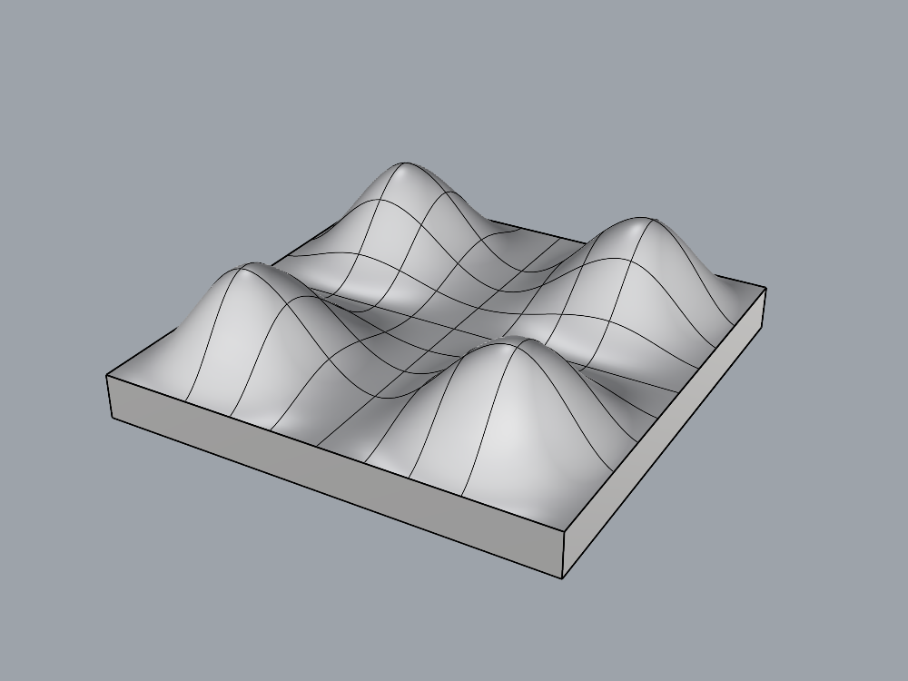
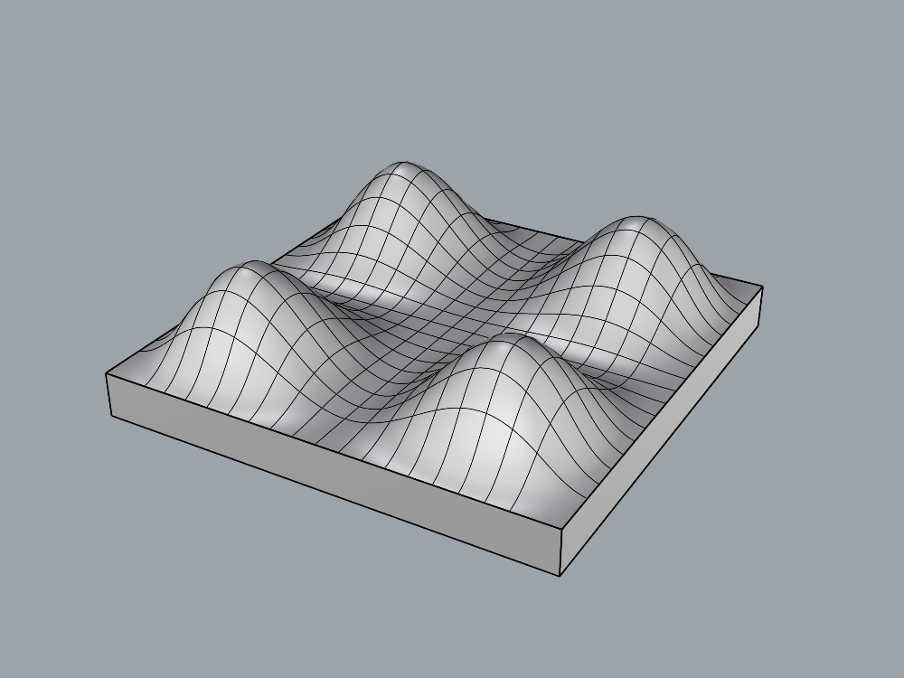

# Closed cushion body through existing tools

The next step after the open top is a closed, measurable body. The public task
`cushion_body_task.json` retains the four-lobed analytic top, adds a flat underside
at Z=0 and four vertical planar walls, and requires one solid named `cushion_body`
on `Cushion::Upholstery::Body`. Scale S is either 1 or 0.75: footprint 100S×100S mm,
minimum vertical thickness 10S mm, peak height 30S mm. The top's interior is C1;
sharp perimeter joins to the sides and bottom are explicitly allowed. This is a
bounded closure task, not finished upholstery with rolled edges.

## Available workflow, not a new production command

The production plugin already has `create_object(type="SURFACE")` and
`run_command`. Rhino's native [Join](https://docs.mcneel.com/rhino/8/help/en-us/commands/join.htm)
can join coincident surface edges into a closed polysurface. There is no need to
claim a missing plugin operation simply because the earlier narrow gateway did
not expose that workflow.

`cushion_body_mcp.py` retains the existing allowed creation/attribute tools and adds
a harness-only `join_surfaces(ids)` recipe. It validates 2..12 distinct nonzero UUIDs
and generates a fixed selection/Join macro through the existing `run_command`
transport. The agent cannot supply raw command strings. The tool requires the same
owned, dedicated document guard and records command results. The agent creates all
geometry, inspects the post-Join object IDs, and assigns final attributes.

This is a supervised expansion of modeling guidance/tool access, not a plugin-code
repair or a paired proof that the agent improved. Native Join does not smooth the
perimeter or repair mismatched surfaces; independent saved-file checks decide
whether the construction actually succeeded.

## Frozen evaluation and calibration

`cushion_body_probe.py` reuses the unchanged cushion-top judge on the independently
extracted nonplanar top face in normalized coordinates. It additionally checks
solid closure, no naked edges, planar boundary placement, a bottom at zero,
volume and interior/exterior point membership. Analytic volume is
`10000 × (10 + 20 × (18/35)²) × S³` mm³, with 1% tolerance. Top height tolerance
is S mm; the original 1,681 surface and 441 target samples remain unchanged.
Only one nonplanar face is allowed in this task. This constrains representation;
finite sampling does not prove complete shape equivalence or appearance quality.

Independent controls construct the top from an explicit Bezier control net and
join separately built planar faces using RhinoCommon in saved File3dm fixtures.
They do not use the MCP creation tool or the gateway's command macro. Eleven files
plus a wrong-scale cross-evaluation give **12 expected verdicts**, measured twice:

- Full-size and 75%-scale bodies pass.
- Open top, missing wall, unjoined pieces, flat top, incorrect underside,
  translation, hidden parent, wrong layer assignment and extra object fail.
- The valid smaller body fails the full-size contract.

Calibration: `runs/cushion-body-calibration-20260906-165916-e73f1c0b/`.
Source/task hashes and independent measurements are retained there. Its
`modeling-results.json` links fresh modeling runs at both scales.

## Scope and continuity

No production plugin/server/contracts change or installation is part of this
milestone. The accepted 61-case repair contract remains unchanged; its earlier
full pass is historical. New body runs use their calibrated controls and developer
tests. Existing open-top rules remain unchanged. The original chair is preserved.
Every modeling milestone includes actual shaded Perspective/Top/Front captures,
with display-mode restoration verified and source image hashes in the roadmap
manifest. Screenshots illustrate geometry; chair visual acceptance stays unscored.

## Fresh full-size result

Run `runs/cushion-body-model-20260906-170006-73abe04e/` passes all 17 predicates;
the fresh planner accepts. Native Join reports six surfaces becoming one closed
polysurface, independently confirmed with zero naked edges. Maximum sampled top
height error is 0.65252 mm against the 1 mm limit. The result is a new agent model,
not a supervisor-added bottom on the earlier saved cushion.

[Top](assets/agent-cushion-body-top.png) · [Front](assets/agent-cushion-body-front.png)

All **451 developer tests pass** (200 experiment, 238 server, 13 contract), including
UUID/macro boundary checks, solid-failure checks and the scale cross-evaluation.
Experiment lint and formatting pass. Developer tests ran as one sequential suite;
there was no overlapping second mock-server suite.

## Scaled fresh result and final checks

Run `runs/cushion-body-model-20260906-170246-4abd21d9/` independently builds the
75 mm version. All 17 predicates pass; the fresh planner accepts. Maximum sampled
height error is **0.18069 mm** against the 0.75 mm limit. The agent initially tried
assigning a nonexistent layer, received the correct error, then created the layers
and completed the assignment. This is an ordinary recovered modeling error, not
a plugin defect. Both runs use the same gateway and evaluator source hashes.

[Top](assets/agent-cushion-body-scaled-top.png) · [Front](assets/agent-cushion-body-scaled-front.png)

Each screenshot fits its own model, so displayed image size does not demonstrate
physical scale; the saved-file measurements do. Both runs preserve the pre-existing
document fingerprint and verify all four display-mode IDs after capture. This is
limited transfer across two sizes of one analytic shape, not broad generalization.
The native Join recipe and task instructions were supervisor-authored; neither
run is evidence of an autonomous production-code improvement.

The next milestone is a separate chair integration attempt using the original public
screenshots and verified cushion, strip and layer workflows. Preserve the baseline
and show comparable views. Rounded perimeter edges, realistic proportions and
upholstery appearance remain unverified; chair visual acceptance stays unscored.

Final campaign `completion.json` records preserved inputs, unchanged installed
binary and original chair, and saved artifacts:

- Full-size SHA-256: `5baf12b709f7288b89ddb87973f6b40b4709223bca2229a7fc492bae251b3542`.
- Smaller SHA-256: `88c97ed7823060678efa920de710fea2e981e677e751c16968b201a81a73a2d1`.

Rhino remains the accepted runtime, PID 84726 / MVID
`326aaa12-b851-4c6a-afcb-45291e734a5c`, with an empty unsaved dedicated document,
serial 268435457, no marker. Recheck ownership and contents before reuse.
