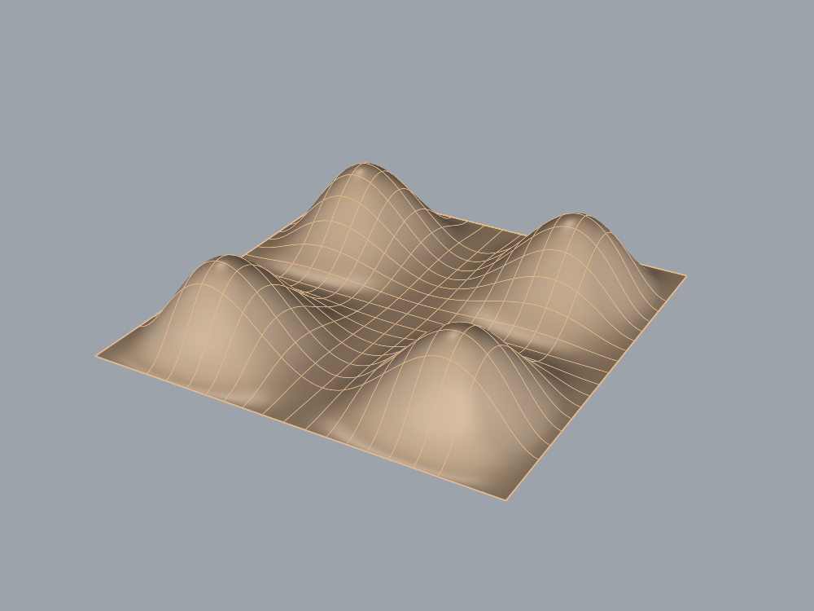

# Continuous cushion-top diagnostic and visual progress

The chair baseline used separate hard panels for its upholstery. This bounded task
asks whether existing RhinoMCP surface tools can instead make one continuous smooth
2×2 top patch. It deliberately stops at an open top surface: thickness, a closed
body, edge roll, material realism and chair integration are later tasks.

## Fixed public task and independent judge

`cushion_task.json` defines a 100×100 mm patch with four lobes. Its analytic target is
`z = 10 + 20 f(x/100) f(y/100)`, with `f(t) = 432 t²(t−0.5)²(t−1)²`.
The perimeter and crossing seams are at Z=10; the four peaks reach Z=30.
The single object is named `cushion_top`, on `Cushion::Upholstery::Top`.
All layers and the object must be visible and unlocked. This is a generated,
explicit geometry benchmark, not a reconstruction of photo-derived upholstery.

The saved-file judge checks one valid untrimmed open face, C1 continuity in both
surface directions, XY bounds, exact layer topology and assignment. It compares
1,681 actual surface samples with the target height and measures nearest-surface
distance from 441 analytic target points. Both error limits are fixed at 1 mm.
This is finite sampling, not a proof of equivalence everywhere or a visual score.
C1 checks reject interior derivative breaks; they do not establish material softness.

Independent positive fixtures use explicit degree-six tensor-product Bezier
control nets, not the plugin's through-point constructor. A second positive changes
surface parameter domains. Ten negatives cover flat padding, missing cross seams,
wrong height, position and scale, split panels, faceting, hidden ancestry, incorrect
layer assignment and extra geometry. Every file is measured twice and its hash
must remain unchanged. Measurement uses the documented
[RhinoCommon surface API](https://developer.rhino3d.com/api/rhinocommon/rhino.geometry.nurbssurface).

An initial calibration attempt incorrectly used unset IDs/indices on standalone
File3dm layers. The positive fixtures correctly failed organization checks. The
supervisor fixed fixture construction to assign IDs and read inserted indices;
no evaluator requirement or tolerance was relaxed. Failed records remain retained.
The final calibration returns all 12 expected verdicts, twice.

## Model screenshots at every modeling milestone

The roadmap now has a visible gallery of actual model captures, from the exact box
through the complex chair diagnostic and subsequent focused tasks. Each card links
to its evidence and opens the full-size image. These are separate benchmark objects,
not successive chair versions. `assets/model-progress.json` records provenance and
image hashes; tracked PNGs remain available after checkout without ignored run data.

New cushion runs save wireframe plus shaded Perspective, Top and Front captures,
and `screenshots.json` with hashes. `model_screenshots.py` restores each viewport's
display mode even when capture fails. The accepted capture tool restores camera
and projection. Screenshots communicate modeling progress; geometry acceptance
continues to use the independent saved file.

## Preservation and scope

Production plugin/server/contracts are unchanged. The accepted 61-case repair
contract remains unchanged and its earlier full pass is historical. This new
harness-only task uses its own independently calibrated controls and developer
tests; no plugin repair or new runtime promotion is implied by a passing model.
The original saved chair is preserved. Model version pinning and stronger evaluator
process isolation remain outstanding.

## First fresh model and screenshot-helper correction

The first fresh modeler run, `runs/cushion-model-20260906-163948-e09d1b86/`,
passes all ten geometry/organization predicates. Maximum sampled height error is
0.24092 mm; target-point distance is below 1e-12 mm. The agent refined its initial
coarse surfaces to a 21×21 cubic through-point surface using only existing tools.
The final saved file and three shaded views exist; its original hash is
`cceaa06fde3a4f4bf37b755348175f3ffba871f4f01f187e2e89d7285d94837a`.

That run stopped before the planner because the new screenshot helper called an
unavailable Guid overload when restoring display modes. Geometry/layers were
cleaned up with an unchanged document fingerprint. Original display modes were
not persisted, so exact display restoration is **not** claimed for that first run;
the supervisor explicitly reset the dedicated test viewports to Wireframe.
`capture-incident.json` preserves the incident and recovery record.

The corrected helper resolves views by their actual viewport IDs, persists original
mode IDs before changing them, and verifies restoration afterward. Its failure-path
unit check passes. A second fresh modeler/planner loop uses unchanged task/evaluator
bytes to validate the complete workflow; this is a harness correction, not a plugin
repair or an improvement in geometry thresholds.

Final calibration with the pinned evaluator: `runs/cushion-calibration-20260906-163932-cefbb616/`.
All **438 developer tests pass** (187 experiment, 238 server, 13 contract). The
focused 13 cushion/capture tests also pass after the screenshot-helper correction.

## Completed second loop

Run `runs/cushion-model-20260906-164426-a4a9967e/` completes the fresh
modeler → independent evaluation → fresh planner sequence. The planner accepts;
all ten predicates pass. Maximum sampled height error is **0.128895 mm**, with
441 target-point distances below 1e-10 mm. The final artifact SHA-256 is
`d4cbd9ff3a6b6b957b3fedc649bde151690736afd392f686d8f6b51261f1cf10`.
The numerical target is explicit public task input, so this is not image inference
or an independent demonstration of generalization.

[Top view](assets/agent-cushion-top.png) · [Front view](assets/agent-cushion-front.png)

The actual agent selected the point grid; the public task provided the analytic
height field, not ready-made point data. Grid density here describes its chosen
construction. The geometry judge remained unchanged between fresh sessions.
`display-modes-restored.json` confirms all four mode IDs were restored;
`preservation.json` confirms the original empty document fingerprint. Final
`completion.json` verifies source pins, the installed binary and original chair hash.
Runtime remains PID 84726 / MVID `326aaa12-b851-4c6a-afcb-45291e734a5c`, empty
unsaved document serial 268435457 with no marker. No builder was dispatched.

The planner recommends adding a scale variation. Carry that recommendation into
future transfer controls. The next supervised milestone is a closed cushion body
with specified thickness and boundary continuity, still using existing operations
first. The open top is accepted only for this fixed surface task; it is not a
finished cushion or an improved chair reconstruction.
