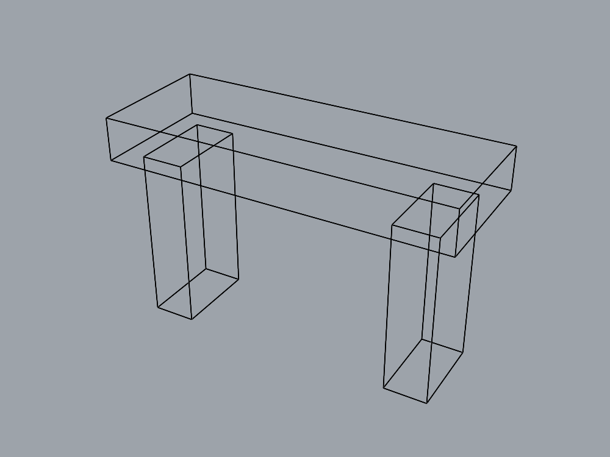

# Deeper assembly organization transfer

This milestone tests the accepted layer-parent capability on a different assembly,
without changing or reinstalling the production plugin. The public task lives in
`assembly_tasks/deep_stand.json`; its schema and semantic checks reject missing
ancestors, unknown part layers, duplicate part names and invalid numeric bounds.

```text
Stand
├── Left
│   └── Support
│       └── Part → left_post
├── Right
│   └── Support
│       └── Part → right_post
└── Top
    └── Part → top
```

There are nine layers and three solid parts. Each post is 10 × 20 × 40 mm, placed
at X=0 and X=60 mm. The top spans (-5,-5,40) to (75,25,50) mm. Both the intermediate
Support name and leaf Part name repeat. This tests four-level paths, branching and
assignments across differently sized parts. It remains a simple organization
benchmark, not a chair reconstruction or general visual-quality score.

`server/.venv/bin/python -m experiments.layer_modeler --task experiments/assembly_tasks/deep_stand.json`
(from the repository root) loads public
structured data and uses the same restricted modeling gateway. With no `--task`,
the original two-cube task and original prompt remain supported. The runner saves
its exact specification, assembled prompt, source snapshots, file hashes, command
logs and modeler/planner results. Existing empty document layers are preserved and
excluded by their original IDs; every newly created layer is evaluated.

## Independent calibration

The existing parent-ID judge now takes an optional explicit layer/part specification.
Its default two-cube rules and numeric tolerance remain unchanged. Saved geometry
measurements still come from the same File3dm reader. The modeling gateway does not expose
the evaluator for reading or editing. Each saved file is opened twice with matching measurements
and unchanged hashes.

`validate_deep_layers.py` independently generates fixtures through File3dm, using
separately specified tree/geometry construction rather than the MCP creation tools.
All **19 cases** have their expected verdicts: nine legacy controls and ten stand
controls. Correct examples pass; faults cover flattened Support nesting, wrong
branch assignment, hidden intermediate layer, locked leaf, Default-layer geometry,
extra geometry, missing part, wrong bounds and an extra layer. The active Rhino
document fingerprint is unchanged by calibration.

Calibration: `runs/deep-layer-calibration-20260906-162009-232d6665/`.
Its `modeling-results.json` links the subsequent fresh sessions.

## Limits and preservation

The judge verifies exact topology, named part count and assignments, layer/object
visibility, lock state, valid solid geometry and world bounds. It does not establish
complete cuboid shape equivalence, manufacturing usefulness, or accurate photo
reconstruction. BOX creation calls provide additional construction evidence.

The accepted **61-case contract remains unchanged**. This harness-only extension
uses the 19 calibration fixtures, nine live layer-command checks, and fresh
legacy/deep assembly runs as targeted
validation; the full 61-case suite is not rerun or claimed as fresh evidence here.
Production source and installed binary remain the accepted layer-parent version.
The original saved chair is untouched. Model/version pinning and OS-level judge
isolation remain outstanding; one new assembly cannot establish broad transfer.

## Fresh runs and outcome

Both fresh modeler/planner loops pass, with matching repeated saved-file reads
and preserved document fingerprints:

- Legacy two-cube assembly: `runs/layer-model-20260906-162152-1456b3ab/`.
- Deeper stand: `runs/layer-model-20260906-162305-f09de086/`; all 14 predicates true.
- Nine live command regressions: calibration campaign `layer-regression/`; all true.



All **425 developer tests pass** (174 experiment, 238 server, 13 contract), plus
experiment lint and formatting. No new plugin defect was found, so no repair
builder was dispatched. The accepted runtime remains PID 84726, MVID
`326aaa12-b851-4c6a-afcb-45291e734a5c`; final state is empty and unsaved with no
ownership marker. Campaign `completion.json` records the runtime and checks.

Next: define a continuous rounded-cushion diagnostic with independently calibrated
geometry checks, retaining hierarchical part assignments. Inspect existing tools
before deciding whether an observed failure needs guidance or a plugin repair.
The chair's visual acceptance remains unscored.
