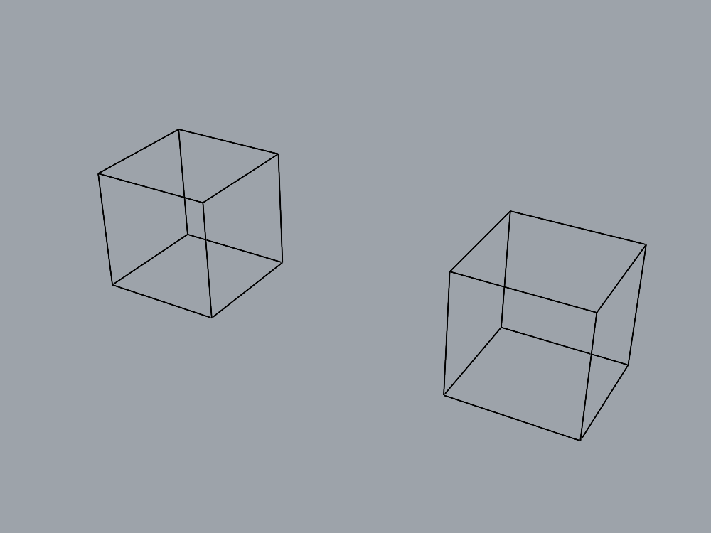

# Bounded layer-parent repair

This milestone follows the independently calibrated diagnosis in
`LAYER_DIAGNOSIS.md`. A fresh builder works in an isolated production checkout with
write access to exactly `CreateLayer.cs`, its Python wrapper and command schema.
The supervisor owns the evaluator, live fixtures, comparison contract and desktop
lifecycle. The layer task remains a reusable assembly test, not a chair-specific fix.

## Candidate behavior

The reviewed patch resolves full parent paths case-insensitively. A short parent
name must identify exactly one nondeleted layer; ambiguity produces an actionable
error. Missing parents and duplicate sibling names fail before insertion. Identical
leaf names under different parents remain valid. The handler checks insertion
failure before accessing the layer. Omitted parent and automatic naming are kept.
Python documentation and the schema describe the same behavior; extra schema
properties are rejected. Other layer handlers are outside this repair.

## Frozen comparison

`harness/trial-layer-parent.json` preserves all 52 accepted requirements and adds
nine focused layer checks. Preflight on the accepted capped-sweep runtime measured
three passing checks and six failures before the trial contract was frozen:

| Layer requirement | Baseline expectation |
| --- | --- |
| Root creation | Pass |
| Automatic name | Pass |
| Unique short-name parent | Pass |
| Full-path parents with duplicate leaves | Fail |
| Saved two-part assembly assignments | Fail |
| Case-insensitive full path | Fail |
| Missing parent rejected without changes | Fail |
| Ambiguous parent rejected without changes | Fail |
| Duplicate sibling rejected clearly without changes | Fail |

The candidate must pass **all 61**. The baseline and restored runtime must reproduce
exactly the original 55-true / six-false vector. Existing task requirements are not
relaxed. Nine independent saved layer fixtures calibrated the reused judge earlier.

The layer checks reopen the saved assembly twice and reconstruct paths from IDs.
They include every layer created for the task, even misplaced roots. Pre-existing
empty document layers are explicitly outside the assembly requirement; objects
assigned to those layers still fail. Full measurements, selection IDs and saved
artifact hashes are retained. Error checks compare entire document fingerprints.
Cleanup removes only newly created layers and owned test objects, then verifies
pre-existing geometry, attributes, layers, units and tolerance.

## Live records

Builder: `runs/repair-20260906-153718-295e7376/`.
Preflight: `runs/layer-baseline-20260906-153836/`.
Trial: `trial-f5110bdd/` inside the builder run.
The pointer `runs/current-layer-trial.txt` identifies the local trial.

Initial setup correctly refused the modified empty document. Setting Modified=false
through the mutating bridge did not make it a fresh document: the command itself
creates an undo record. The supervisor closed that verified empty document and
opened a fresh one before claiming ownership. This was pre-execution setup; no
candidate installation had occurred and no trial state was reset.

The accepted baseline binary is the exact capped-sweep version, MVID
`79b1500e-e20d-47af-9c83-6f915729a712`, SHA-256
`635e8ccf94a55775ea2b58166d83eb995ad517c3de3d66963caed7772a027d7e`.
The trial retains a recovery copy. Binary installation occurs only after the
owning Rhino process exits; copying does not reload a running assembly.

## Scope of the evidence

A successful scripted layer comparison establishes behavior of these operations.
`layer_modeler.py` and its narrow gateway separately let a fresh agent attempt the
same two-cube assembly and judge its saved result. Such a task does not establish
chair visual quality, arbitrary assembly editability or broad transfer. The assembly judge checks validity, solid closure and bounds, not complete cube
shape equivalence; analytic volume/face checks would strengthen a future geometry
benchmark. No forced out-of-memory/insertion failure or every possible Unicode
naming case is claimed.
Desktop lifecycle remains supervised and the trial always restores its baseline;
any later source or runtime adoption is a separate supervisor decision.

## Completed comparison and adoption

Baseline `live-7d0ed7c1`: 55 true / six measured layer failures.
Candidate `live-76378181`: **61/61 true**, six improvements, zero regressions.
Restored baseline `live-602e1038`: exact original case vector.
Final controller state: `accepted_trial`, `runtime_dirty=false`, `promoted=false`.
Each suite includes seven fresh modeling sessions; 21 ran across the comparison.

Candidate MVID: `326aaa12-b851-4c6a-afcb-45291e734a5c`.
Candidate SHA-256:
`a8791fdfd00500113f138375a6b196d32b191873a1c5ef228e4fe1fd1df193e1`.
The exact reviewed patch is retained in `harness/repairs/layer-parent.patch`.
The supervisor separately adopted that tested three-file patch, added permanent
transport/schema tests, and reactivated the exact binary for a fresh assembly task.
The old trial restoration record remains unchanged; `adoption.json` records the
separate decision. No additional production build was needed after adoption.

The candidate build passed with zero warnings/errors, 241 Python/contract tests,
server lint, and ten additional transport/schema tests. Final source validation:
**417 tests pass** (166 experiment, 238 server, 13 contract). The 12 historical
contract return-value warnings remain. Experiment lint/format and server source
lint pass. Full server formatting still has the previously documented unrelated
files; this change does not reformat them.

`harness/trial-preservation-v3.json` now defines the accepted 61-check baseline,
with every result required true. Historical comparison contracts keep their frozen
known-failure vectors. The separate fresh-agent layer task is not counted in 61.

## Fresh-agent result and final runtime

`runs/layer-model-20260906-160939-63c22fdf/` passes every assembly predicate, with
identical repeated measurements. The fresh planner returns `accept`. The saved
artifact SHA-256 is
`2b947c5bd8cc18f5eb6ebed0f744e5461ea26f1cf9b0a22a916b3df3ef7d27eb`.
The agent created both Part leaves, assigned the two BOX objects to their distinct
full paths, and inspected attributes. Cleanup preserved the original document
fingerprint. This is one fresh-agent success, not a paired agent-efficiency study
or evidence of broad unseen-assembly transfer. The CLI default model remains
unversioned; explicit model pinning is still outstanding.

The picture shows the saved geometry; it is the parent-ID and attribute checks
that verify the layer organization. The new gateway exposes only schema lookup
and six allowed geometry/attribute commands, with a document guard and call budget.
The agent cannot execute code, read the judge, or save its own evaluation artifact.

The final `adoption.json` records `accepted_active_baseline` and
`runtime_promoted=true`. Rhino PID **84726** runs the accepted layer-parent MVID
above in one empty unsaved document (serial 268435457), marker none, modified=true
after cleanup. Verify live state before reuse. The previous capped binary remains
available for recovery, and the original saved chair remains untouched.

Next: a different assembly with deeper nesting and repeated intermediate names,
then apply the organization policy to richer geometry. Existing attribute inspection
already returns full paths; inspect that capability before following the planner's
optional suggestion to add another diagnostic tool. Continuous cushions and visual
chair evaluation remain separate milestones.
