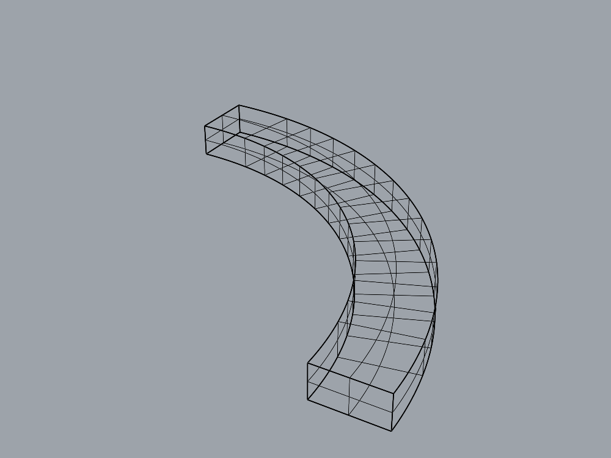

# Fresh-agent curved-strip improvement

2026-09-06. The original task failed on the old plugin and passed on the accepted
sweep-cap version with an identical modeler prompt and evaluator source hashes.
A separate fresh agent also passed a translated version. All 52 preservation
requirements passed, including fresh repeats of both strip tasks. The supervisor
has kept the verified version active as the new baseline.

This is an actual Rhino capture of the accepted saved solid, not the chair target
or a generated concept image. Its wireframe appearance is not the acceptance test.

## Task and independent checks

The bounded objective runner now supports `quarter_annular_strip`: a fixed
90-degree annular sector, centerline radius 100 mm, radial width 20 mm, height
10 mm, and a public XYZ translation. This version intentionally fixes the shape;
it does not support arbitrary radii/angles or infer shape from images.

The task uses a narrow `sweep1` gateway with optional planar capping. Sweep is
disabled for all older task types. The agent can create/inspect/translate geometry
and delete its construction objects, but cannot read or modify the saved-file
judge, invoke arbitrary code, or export its own evaluation artifact.

The supervisor saves the model and measures it twice. The judge transforms an
in-memory duplicate into the task's local frame, then checks one valid closed
solid, no naked edges, units, analytic volume/area/bounds and 192 membership
samples. **Reported bounds are local coordinates**, not world coordinates. The
translated task uses world offset (150, -80, 25), so its world bounds are
approximately (150, -80, 25) to (260, 30, 35).

Nine live calibration cases use independently extruded sector fixtures, including
inward/outward solid orientations, incorrect width/radius/position, extra objects,
a correct translated object and both wrong-pose cross-evaluations. Each returned
its expected verdict twice. The active document was unchanged. Measurement code,
task schemas and numeric tolerances were fixed before modeling.

## Observed comparison

| Run | Plugin | Agent result | Tool calls | Agent time |
| --- | --- | --- | --- | --- |
| Origin baseline | Original, without capping | Fail / honestly incomplete | 14 | 85.1 s |
| Origin repeat | Accepted sweep-cap version | Pass / one closed solid | 6 | 36.2 s |
| Translated task | Accepted sweep-cap version | Pass / correct world pose | 7 | 39.9 s |

The baseline agent requested capping twice, inspected valid but open Breps, then
deleted the failed geometry and construction curves. Its saved artifact is empty
and fails the objective task. The failure record and honest incomplete claim are
preserved. This was a controlled use of the same client/gateway against the old
backend, which ignored the new cap option; it was not discovery of a new defect.
No new builder was dispatched because the accepted source fix already existed.

On the improved plugin, each fresh agent requested one capped sweep, inspected
the resulting solid and removed its construction geometry. Both saved solids have
zero naked edges, volume approximately 31415.923 mm³ and area 9824.777 mm², with
all mandatory predicates and repeat measurements passing. Both planners accept.
The translated modeler used the translation tool after constructing its strip.

This is one paired origin comparison and a translated task, not a statistical
benchmark or evidence of broad unseen-shape generalization. Times are individual
agent session durations, excluding startup/evaluation/planning. The CLI uses its
default model; explicit model/version pinning is still outstanding. No improved
chair reconstruction is claimed, and the chair remains one of several benchmarks.

## Local records and runtime

Campaign: `runs/strip-modeling-20260906-140908/`.

- Baseline: `runs/20260906-141005-0e054cf6/`.
- Improved origin: `runs/20260906-141535-2697590c/`.
- Translated: `runs/20260906-141625-1670bbd8/`.

The campaign records calibration, frozen source copies/hashes, baseline and
activation identities, exact prompts, saved artifacts, the paired comparison,
and preservation inputs/results. Full local run logs are ignored by Git; the
representative image and this report are portable.

The supervisor installed the exact previously accepted binary only after the old
Rhino process exited. No source change or rebuild of the production plugin was
needed. Its MVID is `79b1500e-e20d-47af-9c83-6f915729a712`, SHA-256
`635e8ccf94a55775ea2b58166d83eb995ad517c3de3d66963caed7772a027d7e`.
The original binary remains in the previous trial for recovery. Keeping this
accepted version active is an explicit supervisor decision, separate from the
trial controller's mandatory restoration policy.

`harness/trial-preservation-v2.json` defines the new baseline contract: the previous
50 requirements plus both fresh-agent strip tasks, **all required to pass**.
The previous three known cap failures are no longer accepted for this baseline.
The historical 43-case and old/candidate 50-case contracts remain available.

Final validation: **392 developer tests pass** (151 experiment, 228 server,
13 contract), with 12 existing contract-test return-value warnings. The live suite
passes **52/52**, including two further fresh strip sessions:
`runs/20260906-142208-532f24cb/` and `runs/20260906-142301-9d387ea4/`.
Thus each pose passed twice in fresh sessions on the improved runtime. All frozen
preservation inputs remained unchanged. This is still a small fixed-shape sample.

The final activation record is `activation.json` in the campaign directory,
with stage `accepted_active_baseline` and `runtime_promoted=true`. The previous
trial's restoration record is unchanged. At handoff Rhino PID 94887 has one empty
unsaved document (serial 268435457), no experiment marker, modified=true after
cleanup. Recheck live ownership before reuse. The original saved chair is untouched.

Next: define and independently validate hierarchical layer relationships and part
assignments, including duplicate child names and persistence in saved models.
